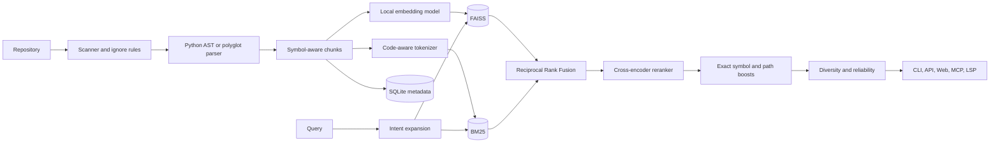

# Semantic Code Intelligence

Local-first semantic search and cited code walkthroughs for software repositories.

Semantic Code Intelligence parses a repository into symbol-aware chunks, indexes those chunks with FAISS and BM25, fuses both result sets, and reranks the strongest candidates with a cross-encoder. Results include exact file paths and line ranges. Everything runs locally; no cloud API key is required.

## What it provides

- Hybrid semantic and lexical code search
- Exact symbol, path, and contextual-term boosting
- Search reliability labels based on retrieval agreement
- Python AST parsing and structural parsing for common programming languages
- Exact citations such as `src/auth.py:L42-L67`
- Browser dashboard and REST API
- CLI, MCP, and LSP interfaces
- Local Ollama-powered code walkthroughs with a deterministic evidence fallback
- FAISS, BM25, and SQLite index persistence
- Incremental filesystem watching
- Symbol and dependency graphs
- Reproducible indexing and retrieval benchmarks

## Requirements

- macOS or Linux
- Python 3.10 or newer
- Git
- Approximately 2–4 GB of free disk space for Python dependencies and local model caches
- Optional: [uv](https://docs.astral.sh/uv/) for faster environment management
- Optional: [Ollama](https://ollama.com/) for generated code walkthroughs

The first indexing and reranking operations require internet access to download Hugging Face model weights. After the models are cached, retrieval works offline.

## Quick start from a clean machine

### 1. Clone the repository

```bash
git clone https://github.com/saitarrun/semantic-code-intelligence.git
cd semantic-code-intelligence
```

### 2. Create an environment and install the application

Using `uv`:

```bash
uv venv
source .venv/bin/activate
uv pip install -e .
```

Using standard Python tooling:

```bash
python3 -m venv .venv
source .venv/bin/activate
python -m pip install --upgrade pip
python -m pip install -e .
```

Windows is not currently a tested target, but the equivalent activation command is `.venv\Scripts\activate`.

### 3. Download the retrieval models and create an index

Model downloads are deliberately disabled by default so normal application requests never trigger unexpected network traffic. Explicitly enable downloads during the first index and query:

```bash
export CODE_INTEL_ALLOW_MODEL_DOWNLOADS=1

code-intel index .
code-intel query "Where is HybridRetrievalPipeline implemented?" --citations-only

unset CODE_INTEL_ALLOW_MODEL_DOWNLOADS
```

This prepares:

- `sentence-transformers/all-MiniLM-L6-v2` for dense embeddings
- `cross-encoder/ms-marco-MiniLM-L-6-v2` for reranking

The repository index is stored in `.code_intel_index/`. The directory contains the FAISS index, BM25 data, and SQLite metadata and should not be committed.

### 4. Start the web application

```bash
code-intel serve --host 127.0.0.1 --port 8000
```

Open [http://127.0.0.1:8000](http://127.0.0.1:8000).

The dashboard includes:

- Semantic Search
- Code Walkthrough
- Dependency Map
- Diff and LSP tools
- Repository selection and reindexing controls
- Per-stage latency and retrieval-reliability indicators

## Index another repository

Index data is stored inside the target repository by default:

```bash
code-intel index /absolute/path/to/project
```

Search that repository:

```bash
code-intel query \
  "How are access tokens validated?" \
  --dir /absolute/path/to/project
```

Use a separate index directory when the source repository should remain untouched:

```bash
code-intel index /absolute/path/to/project \
  --index-dir /absolute/path/to/index-storage

code-intel query \
  "Where is the database connection pool created?" \
  --dir /absolute/path/to/project \
  --index-dir /absolute/path/to/index-storage
```

Force a clean rebuild after changing parser or embedding behavior:

```bash
code-intel index /absolute/path/to/project --force
```

## Semantic search

Hybrid mode is recommended. It combines natural-language similarity with exact identifier matching:

```bash
code-intel query "How does the application serve the web UI?"
```

Exact symbol search:

```bash
code-intel query "Where is serve_ui implemented?"
```

Return more results:

```bash
code-intel query "authentication middleware" --top-k 10
```

Show citations without printing code:

```bash
code-intel query "database transaction rollback" --citations-only
```

Select an individual retrieval strategy for diagnostics:

```bash
code-intel query "PaymentProcessor" --mode sparse
code-intel query "logic responsible for charging a customer" --mode dense
code-intel query "charge customer payment" --mode hybrid
```

Disable cross-encoder reranking when lower latency matters more than precision:

```bash
code-intel query "configuration loader" --no-rerank
```

### How ranking works

The default hybrid pipeline performs these stages:

1. Expand common developer intents with deterministic code-domain terms.
2. Retrieve up to 50 dense FAISS candidates.
3. Retrieve up to 50 lexical BM25 candidates.
4. Fuse up to 60 unique candidates with Reciprocal Rank Fusion.
5. Rerank up to 40 candidates with a local cross-encoder.
6. Boost exact symbols, paths, and contextual term matches.
7. Remove duplicate citations and limit repetitive same-file results.
8. Return a reliability label with the evidence behind it.

Reliability is not an LLM confidence score. It reports observable retrieval signals such as dense/lexical agreement, exact symbol matches, path overlap, and semantic similarity.

## Code walkthroughs

### Deterministic evidence mode

This mode does not require Ollama. It returns retrieved symbols, scopes, dependencies, source blocks, and citations without inventing behavior:

```bash
code-intel ask \
  "How does the indexing pipeline persist metadata?" \
  --provider extractive
```

### Generated local walkthroughs with Ollama

Install and start Ollama, then download the default model:

```bash
ollama pull qwen2.5-coder:7b
```

Run a cited walkthrough:

```bash
code-intel ask "Explain the hybrid retrieval control flow"
```

Use another local model or Ollama server:

```bash
export CODE_INTEL_OLLAMA_MODEL=deepseek-coder-v2:lite
export OLLAMA_BASE_URL=http://127.0.0.1:11434
```

If Ollama cannot be reached, the application clearly labels the response `extractive-fallback` and returns deterministic source evidence.

## Interactive CLI

Start a continuous search session:

```bash
code-intel interactive --dir /absolute/path/to/project
```

Inspect index statistics:

```bash
code-intel stats --dir /absolute/path/to/project
```

Display all commands:

```bash
code-intel --help
code-intel query --help
```

## REST API

Start the server:

```bash
code-intel serve --host 127.0.0.1 --port 8000
```

Health check:

```bash
curl http://127.0.0.1:8000/api/health
```

Index a repository:

```bash
curl -X POST http://127.0.0.1:8000/api/index \
  -H 'Content-Type: application/json' \
  -d '{
    "target_dir": "/absolute/path/to/project",
    "force": false
  }'
```

Run hybrid search:

```bash
curl -X POST http://127.0.0.1:8000/api/search \
  -H 'Content-Type: application/json' \
  -d '{
    "query": "Where is token validation implemented?",
    "repo_path": "/absolute/path/to/project",
    "top_k": 5,
    "mode": "hybrid",
    "rerank": true
  }'
```

Generate a walkthrough:

```bash
curl -X POST http://127.0.0.1:8000/api/synthesize \
  -H 'Content-Type: application/json' \
  -d '{
    "query": "Explain token validation failure paths",
    "repo_path": "/absolute/path/to/project",
    "top_k": 8,
    "provider": "extractive"
  }'
```

Important endpoints:

| Method | Endpoint | Purpose |
| --- | --- | --- |
| `GET` | `/api/health` | Service and index status |
| `GET` | `/api/stats` | Files, lines, chunks, and index manifest |
| `GET` | `/api/index/stream` | SSE indexing progress |
| `POST` | `/api/index` | Synchronous repository indexing |
| `POST` | `/api/search` | Dense, sparse, or hybrid search |
| `POST` | `/api/synthesize` | Cited code answer |
| `POST` | `/api/synthesize/stream` | Streaming cited answer |
| `GET` | `/api/graph` | Symbol and dependency graph |
| `POST` | `/api/watcher/toggle` | Start or stop incremental watching |
| `GET` | `/api/lsp/inspect` | Definitions, references, and hover data |
| `POST` | `/api/patch/generate` | Generate a proposed unified diff |
| `POST` | `/api/patch/apply` | Apply a unified diff to the selected repository |

Bind to `127.0.0.1` unless remote access is intentionally required. Patch and file-opening endpoints operate on the local filesystem and should not be exposed to untrusted networks.

## MCP integration

Start the stdio MCP server:

```bash
code-intel mcp
```

Example MCP client configuration:

```json
{
  "mcpServers": {
    "semantic-code-intelligence": {
      "command": "/absolute/path/to/semantic-code-intelligence/.venv/bin/code-intel",
      "args": ["mcp"],
      "cwd": "/absolute/path/to/project"
    }
  }
}
```

Available MCP tools:

- `code_intel_search`
- `code_intel_symbol_graph`
- `code_intel_index`

The target project must be indexed before search or graph requests.

## LSP and filesystem watcher

Start the stdio LSP bridge:

```bash
code-intel lsp --dir /absolute/path/to/project
```

Start the incremental watcher:

```bash
code-intel watch --dir /absolute/path/to/project
```

The watcher observes supported source files and refreshes index state after changes. Use `Ctrl+C` to stop either process.

## Configuration

Environment variables:

| Variable | Default | Description |
| --- | --- | --- |
| `CODE_INTEL_ALLOW_MODEL_DOWNLOADS` | `0` | Set to `1` to permit Hugging Face model downloads |
| `CODE_INTEL_OLLAMA_MODEL` | `qwen2.5-coder:7b` | Ollama model used for generated walkthroughs |
| `OLLAMA_BASE_URL` | `http://127.0.0.1:11434` | Ollama API base URL |
| `CODE_INTEL_CORS_ORIGINS` | Localhost origins | Comma-separated browser origins allowed by the API |
| `CODE_INTEL_PIPELINE_CACHE_SIZE` | `4` | Maximum number of repository pipelines cached by the API |

Programmatic configuration:

```python
from pathlib import Path

from semantic_code_intel.config import CodeIntelConfig
from semantic_code_intel.indexing.engine import HybridIndexer
from semantic_code_intel.retrieval.pipeline import HybridRetrievalPipeline

project = Path("/absolute/path/to/project")
config = CodeIntelConfig(project_root=project)
config.retrieval.dense_top_k = 75
config.retrieval.sparse_top_k = 75
config.retrieval.final_top_k = 8

HybridIndexer(config).index_codebase(project)
response = HybridRetrievalPipeline(config).query(
    "Where is request authentication enforced?",
    top_k=8,
)

for result in response.results:
    print(result.citation, result.chunk.symbol_name, result.score)

print(response.reliability, response.reliability_reasons)
```

## Supported files

The default scanner includes:

- Python
- JavaScript and TypeScript
- Go
- Rust
- Java
- C and C++
- C#
- Ruby
- PHP
- Swift
- Kotlin and Scala
- Shell scripts
- SQL
- HTML and CSS
- JSON, YAML, TOML, and Markdown

Common generated directories, virtual environments, dependency folders, lock files, binaries, minified assets, `.git`, `.code_intel_index`, and `oss_evaluation` are excluded by default. See `ParserConfig` in `semantic_code_intel/config.py` to customize extensions and ignore patterns.

## Architecture



Core modules:

| Package | Responsibility |
| --- | --- |
| `parser` | Repository scanning and structural code chunking |
| `indexing` | Embeddings, FAISS, BM25, SQLite, and watching |
| `retrieval` | Query expansion, fusion, reranking, reliability, and citations |
| `generation` | Grounded prompts, Ollama synthesis, and deterministic fallback |
| `api` | FastAPI endpoints and browser dashboard |
| `cli` | Command-line interfaces |
| `graph` | Symbol and dependency graphs |
| `mcp` | Model Context Protocol server |
| `lsp` | Language Server Protocol bridge |
| `benchmark` | Synthetic repository generation and retrieval evaluation |

## Testing

Run the complete test suite:

```bash
uv run pytest -q
```

Or with an activated environment:

```bash
pytest -q
```

The suite covers parsers, FAISS, BM25, query expansion, exact-match boosting, fusion, citations, API endpoints, local synthesis behavior, MCP, LSP, patching, watching, and benchmark generation.

## Benchmarking

Run a reproducible synthetic benchmark:

```bash
code-intel benchmark \
  --workspace ./benchmark_workspace \
  --loc 40000 \
  --queries 30
```

The runner writes `benchmark_report.json` containing:

- Dataset and index sizes
- Indexing throughput
- Dense, sparse, reranker, and end-to-end latency percentiles
- Hit rate and mean reciprocal rank
- Executed query records
- Python, platform, hardware, package, and model metadata

Benchmark results depend on hardware, model cache state, repository composition, and query set. Treat historical figures as measurements, not guarantees.

## Troubleshooting

### Model is not available locally

Run the failed operation once with downloads enabled:

```bash
CODE_INTEL_ALLOW_MODEL_DOWNLOADS=1 code-intel index /absolute/path/to/project --force
CODE_INTEL_ALLOW_MODEL_DOWNLOADS=1 code-intel query "warm up reranker" --dir /absolute/path/to/project
```

### Index not found

The `--dir` and `--index-dir` values used for querying must match those used for indexing.

```bash
code-intel stats --dir /absolute/path/to/project
```

### Walkthrough says Ollama is unavailable

Verify the local server and installed models:

```bash
ollama list
curl http://127.0.0.1:11434/api/tags
```

You can always use deterministic evidence mode:

```bash
code-intel ask "your question" --provider extractive
```

### Search results are weak

- Use the exact class, function, method, endpoint, or configuration name when known.
- Prefer hybrid mode for normal use.
- Increase `--top-k` when the answer spans multiple files.
- Reindex with `--force` after changing parser or embedding configuration.
- Check the reliability label; low reliability means the retrieval signals do not strongly agree.

### Server port is already in use

Choose another port:

```bash
code-intel serve --host 127.0.0.1 --port 8010
```

## Project status

This project is under active development. Review generated patches before applying them, keep the API bound to localhost for normal use, and validate benchmark claims on your own target repositories.

## License

No open-source license has been added yet. Public access to the repository does not by itself grant permission to copy, modify, or redistribute the code.
