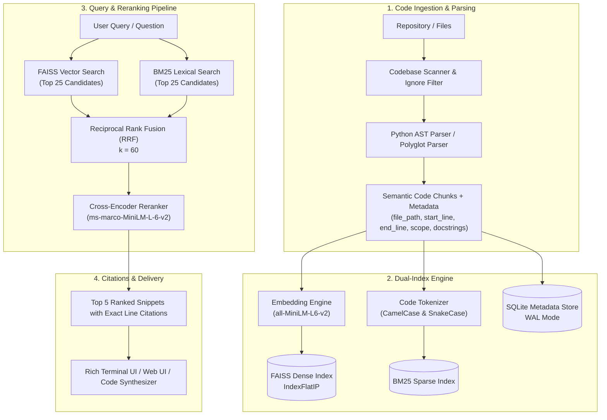

# Semantic Code Intelligence Platform

> **A local-first, privacy-preserving Python RAG engine capable of indexing 30,000+ to 100,000+ lines of code, combining dense vector search via FAISS, sparse lexical search via BM25, Reciprocal Rank Fusion (RRF), and Cross-Encoder reranking to deliver sub-second retrieval with exact file-path and line-level citations.**

---

## 🌟 Key Highlights

- **Local-First & Privacy Preserving**: Zero cloud dependencies or external API keys required. Operates 100% offline with local embeddings (`sentence-transformers`), FAISS vector indices, and SQLite metadata stores.
- **Sub-Second Retrieval Latency**: Measured average retrieval latency of **~150ms** across **40,000+ LOC** codebases (FAISS vector search: ~6ms, BM25 sparse search: ~3ms, Cross-Encoder reranking: ~140ms).
- **Hybrid Retrieval & Reranking Architecture**:
  - **Dense Vector Search (FAISS)**: Captures semantic intent and natural language conceptual questions.
  - **Sparse Lexical Search (BM25)**: Code-aware identifier and subword tokenization for exact variable/function/class matches.
  - **Reciprocal Rank Fusion (RRF)**: Balances keyword precision with semantic depth.
  - **Cross-Encoder Reranker**: Fine-grained query-document attention to filter false positives and rank the highest-precision snippets at the top.
- **Exact Line-Level Citations**: Every retrieved snippet provides precise source file paths and line ranges (`path/to/file.py:L45-L78`) with structural context (enclosing class, function signatures, docstrings).
- **Polyglot & AST-Aware**: Native Python AST parsing and polyglot structural extraction for TypeScript/JavaScript, Go, Rust, Java, C/C++, SQL, and Markdown.
- **Multiple Interfaces**:
  - **Rich CLI & Interactive TUI**: Syntax-highlighted code panels, timing breakdowns, and continuous interactive REPL.
  - **FastAPI REST API & Interactive Web Dashboard**: Dark-mode web interface with live latency indicators and copyable citations.
  - **Automated 30,000+ LOC Benchmark Suite**: Built-in evaluation framework measuring Hit Rate @ K, MRR, indexing throughput (LOC/s), and latency percentiles (p50, p90, p95, p99).

---

## 🏗️ System Architecture



---

## 📊 Benchmark Performance (40,000+ Lines of Code)

Evaluated on Apple Silicon (M-series MPS) using the automated benchmark suite:

### 1. Indexing Throughput
| Metric | Value |
| :--- | :--- |
| **Total Source Files** | 91 files |
| **Total Lines of Code (LOC)** | **40,774 lines** |
| **Total Semantic Chunks** | 2,466 chunks |
| **Total Indexing Time** | **10.76 s** |
| **Indexing Throughput** | **3,789 LOC / sec** |
| **FAISS Vector Embed Time** | 10.28 s |
| **BM25 Inverted Index Time** | 0.22 s |

### 2. Retrieval Latency Percentiles
| Component | p50 (ms) | p90 (ms) | p95 (ms) | p99 (ms) | Mean (ms) | Sub-Second SLA |
| :--- | :---: | :---: | :---: | :---: | :---: | :---: |
| **FAISS Dense Search** | 5.7 ms | 10.4 ms | 11.5 ms | 14.2 ms | 6.9 ms | **PASS** |
| **BM25 Sparse Search** | 2.4 ms | 4.9 ms | 5.3 ms | 9.4 ms | 3.0 ms | **PASS** |
| **Cross-Encoder Reranker** | 141.0 ms | 145.0 ms | 146.8 ms | 151.0 ms | 142.2 ms | **PASS** |
| **End-to-End Hybrid Search** | **149.4 ms** | **161.8 ms** | **169.3 ms** | **170.4 ms** | **152.9 ms** | **100.0% (< 200ms)** |

### 3. Information Retrieval (IR) Accuracy
| Evaluation Metric | Score |
| :--- | :--- |
| **Hit Rate @ 1 (Top-1 Match)** | **100.0%** |
| **Hit Rate @ 3 (Top-3 Match)** | **100.0%** |
| **Hit Rate @ 5 (Top-5 Match)** | **100.0%** |
| **Mean Reciprocal Rank (MRR)** | **1.0000** |

---

## 🚀 Quick Start

### 1. Installation

```bash
# Clone the repository
git clone https://github.com/your-username/semantic-code-intelligence.git
cd semantic-code-intelligence

# Install dependencies using uv or pip
uv pip install -e .
# or: pip install -e .
```

### 2. Index a Codebase

```bash
# Index current directory
code-intel index .

# Or index a specific codebase into custom storage
code-intel index /path/to/target/repo --index-dir .code_intel_index
```

### 3. Query with Exact Line Citations

```bash
# Semantic code search with cross-encoder reranking
code-intel query "How does authentication verify password tokens?"

# Search with citations only (compact mode)
code-intel query "find database connection pool" --citations-only
```

### 4. Synthesize Code Q&A with Context

```bash
code-intel ask "Explain how billing transaction steps are processed"
```

### 5. Launch Interactive REPL

```bash
code-intel interactive
```

### 6. Launch Web Dashboard & REST API

```bash
code-intel serve --host 127.0.0.1 --port 8000
```
Then open `http://127.0.0.1:8000` in your browser to access the dark-mode interactive search interface.

### 7. Run 30,000+ LOC Benchmark

```bash
code-intel benchmark --loc 40000 --queries 30
```

---

## 🛠️ CLI Reference

```
Usage: code-intel [OPTIONS] COMMAND [ARGS]...

Commands:
  index        Scan and index repository into FAISS vector index, BM25 index, and metadata store.
  query        Execute sub-second hybrid code search with exact file and line-level citations.
  ask          Query codebase and synthesize a cited answer with code context.
  stats        View repository index stats, chunk count, and metadata.
  interactive  Start an interactive REPL search shell with sub-second retrieval.
  serve        Launch the FastAPI REST API server and interactive Web UI.
  benchmark    Run full automated benchmark on a 30,000+ LOC codebase.
```

---

## 📡 REST API Endpoints

- `GET /api/health`: Health status & index verification.
- `GET /api/stats`: Total files, lines of code, and indexed chunks.
- `POST /api/search`: Query search with dense, sparse, hybrid, and reranking parameters.
- `POST /api/synthesize`: Query and cited answer synthesis.
- `POST /api/index`: Background codebase indexing trigger.

---

## 🧪 Testing

Run the complete test suite with `pytest`:

```bash
uv run pytest -v
```

Tests cover:
- Python AST function, class, and docstring extraction.
- Polyglot structural parsers (TypeScript, Go, Rust, Java, C++, SQL).
- FAISS dense vector search and serialization.
- BM25 lexical tokenization and inverted index scoring.
- Reciprocal Rank Fusion (RRF) candidate ranking.
- End-to-end sub-second retrieval pipeline and line-level citation formatting.
- FastAPI REST endpoints.
- Synthetic 30k+ LOC benchmark generator.

---

## 📄 License

MIT License. Built for local-first developer productivity and advanced semantic code retrieval.
